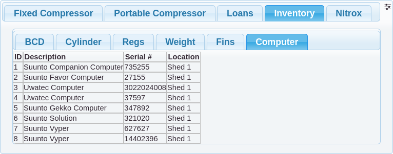

# Inventory

The inventory contains a list of club equipment classified by their use. Each piece of equipment is allocated a
unique id or, for equipment such as weights, a count is kept.

HSAC uses a spreadsheet on Google Drive to maintain their inventory. Because access to the web is
unreliable and expensive, the app uses a cache of the inventory in the application database. This
is likely to change in the future.

