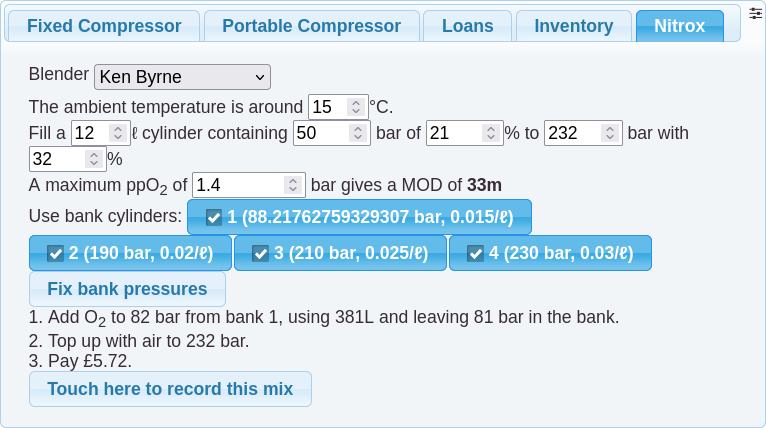

# Nitrox

The app can be used both to calculate nitrox blending solutions, and
also to log the use of gas from a bank of O2 cylinders. Access to this
functionality is restricted to qualified blenders.

## Blending
The goal is to calculate the fill solution that is lowest cost in
terms of extra O2 lost from bleeding down, and gas added from a bank
of O2 cylinders, using the lowest pressure cylinders first and
sequentially higher pressure cylinders to top up. There is a bank of
up to 4 bank cylinders, each of a known size and pressure. These will
normally contain pure O2, but there's support for mixing from Nitrox
cylinders as well. The cost of O2 from each cylinder can be priced
individually.

The blending process works in a number of steps. Starting with the
lowest pressure bank cylinder,
1. Bleed down the cylinder
2. Add O2 from a bank cylinder to a target pressure
3. Top up with air to a target pressure
Steps 2 and 3 are repeated up to three times using the higher pressure
bank cylinders.
 
Note that the calculations use an ideal gas approximation. There is
support for real gas approximation but it is significantly more
complex and makes little difference to the results.
 
For an overview of the mathematics of gas blending you are highly
recommended to read [Gary Kessler's paper](https://scuba.garykessler.net/library/BlendingPaper.pdf)
which was the source for the formulas used in the app.

## Logging
When a blending solution is calculated, the O2 used can optionally be logged.
